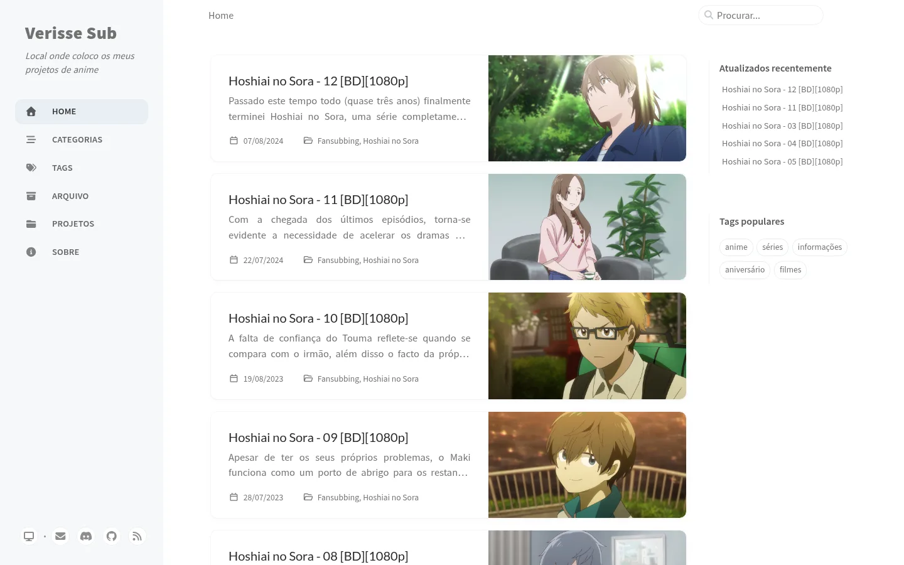

# Verisse Sub

[](https://github.com/DigoqueDigo/DigoqueDigo.github.io/actions/workflows/pages-deploy.yml)
[](https://github.com/cotes2020/jekyll-theme-chirpy)
[](https://www.ruby-lang.org/)

Source of [digoquedigo.github.io](https://digoquedigo.github.io), the website of the Verisse Sub fansub. It hosts the release notes for each episode, news about the group, and the list of finished projects with their download links. Everything on the site is written in European Portuguese.

<picture>
  <source media="(prefers-color-scheme: dark)" srcset=".github/assets/screenshot-dark.webp">
  
</picture>

## Stack

| Part | What it uses |
| --- | --- |
| Site generator | [Jekyll](https://jekyllrb.com/) 4.4 |
| Theme | [Chirpy](https://github.com/cotes2020/jekyll-theme-chirpy) 7.6, installed as a gem |
| Comments | [giscus](https://giscus.app/), stored in this repo's Discussions ("Comments" category) |
| Analytics and page views | [GoatCounter](https://www.goatcounter.com/) (`verissesub`) |
| Hosting | GitHub Pages, deployed by GitHub Actions |
| Extras | Offline-capable PWA, full-text search, light/dark theme |

## Repository layout

```text
_posts/                  posts, one Markdown file each
_tabs/                   sidebar pages (about, archives, categories, projects, tags)
_data/
  authors.yml            post authors
  contact.yml            contact buttons at the bottom of the sidebar
  share.yml              share buttons under each post
  locales/pt.yml         Portuguese interface strings
_plugins/
  posts-lastmod-hook.rb  sets each post's "Atualizado" date from git history
_sass/custom.scss        style overrides on top of Chirpy
assets/img/
  favicons/              site icons
  thumbnails/            post cover images
  posts/                 images used inside posts
assets/.scripts/         image helper scripts
tools/                   run.sh (local server) and test.sh (build + checks)
_config.yml              site settings
```

The theme's layouts, includes and most styles come from the `jekyll-theme-chirpy` gem, so they aren't in this repository. Run `bundle info --path jekyll-theme-chirpy` to find them.

## Getting started

You need Ruby 4.0 and Bundler.

```sh
git clone git@github.com:DigoqueDigo/DigoqueDigo.github.io.git
cd DigoqueDigo.github.io
bundle install
```

> [!NOTE]
> Chirpy 7.6 only declares support for Ruby below 4.0, until Jekyll officially supports Ruby 4. The `Gemfile` lifts that limit for the theme when running on Ruby 4. Remove that block once Chirpy allows Ruby 4.

## Local development

```sh
tools/run.sh       # http://127.0.0.1:4000 with live reload
tools/run.sh -p    # production mode, like the deployed site
tools/test.sh      # production build + HTML-Proofer, the same checks CI runs
```

Production mode compresses the HTML and turns on the PWA service worker and analytics, which are off in normal development. `tools/run.sh -H 0.0.0.0` makes the server reachable from other devices on your network.

## Writing a post

Create the file with [jekyll-compose](https://github.com/jekyll/jekyll-compose):

```sh
bundle exec jekyll compose "Hoshiai no Sora - 12 [BD][1080p]"
```

That creates `_posts/YYYY-MM-DD-hoshiai-no-sora-12-bd-1080p.md` with the title and date set and the other front matter fields empty. Existing posts fill them in like this:

```yaml
---
title: Hoshiai no Sora - 12 [BD][1080p]
date: 2024-08-07 21:52 +0100
author: digo
categories: [Fansubbing, Hoshiai no Sora]
tags: [anime, séries]
image: ./assets/img/thumbnails/037c941ca118f72137e3ee7ad50ced1e85e7b2a4.jpeg
---
```

- **Categories:** releases use `[Fansubbing, <series>]`, and news about the group uses `[Blogging, Informações]`.
- **Tags:** releases use `anime` plus `séries` or `filmes`, and news uses `informações`.
- **Images:** save cover images in `assets/img/thumbnails/` and images used inside a post in `assets/img/posts/`. All are JPEGs named by their SHA-1 hash. `assets/.scripts/convertion.sh <dir>` converts every PNG/JPG in a folder to that format (requires `ffmpeg`).
- **Formatting:** Chirpy adds extras such as callout boxes (`{: .prompt-info }`, `.prompt-warning`, `.prompt-tip`) and image size classes. See its [writing guide](https://chirpy.cotes.page/posts/write-a-new-post/).
- **Projects page:** when a project is finished, add it to the table in `_tabs/projects.md`.

The "Atualizado" date on a post comes from its latest commit, so it only shows once the post has been edited after its first commit. That's also why the deploy workflow checks out the full git history.

## Deployment

Every push to `main` runs [`pages-deploy.yml`](.github/workflows/pages-deploy.yml):

1. Builds the site with `JEKYLL_ENV=production`.
2. Checks it with HTML-Proofer, covering internal links, images and scripts. External links aren't checked.
3. Publishes it to GitHub Pages.

If the checks fail, nothing is deployed and the current site stays online. Run `tools/test.sh` before pushing to catch problems early.

## Upgrading Chirpy

1. Apply the changes from the new [chirpy-starter](https://github.com/cotes2020/chirpy-starter) release, as described in Chirpy's [upgrade guide](https://github.com/cotes2020/jekyll-theme-chirpy/wiki/Upgrade-Guide). Read the [release notes](https://github.com/cotes2020/jekyll-theme-chirpy/releases) for config changes.
2. Compare the two theme files this site overrides with their new versions in the gem:
   - `assets/css/jekyll-theme-chirpy.scss`, which also loads `_sass/custom.scss`
   - `_data/locales/pt.yml`, against the theme's `pt-BR.yml` and `en.yml`, to pick up new strings
3. Run `bundle update --all` and `tools/test.sh`.

## License

The site's code is under the [MIT License](LICENSE). Posts are under [CC BY 4.0](https://creativecommons.org/licenses/by/4.0/).
